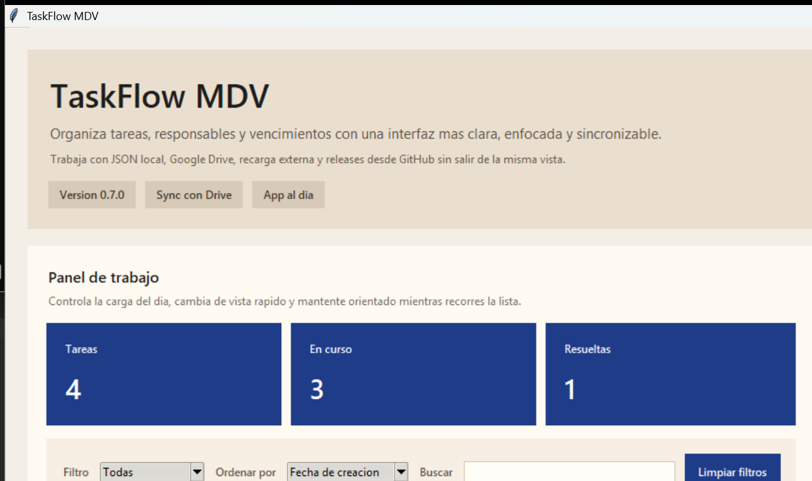
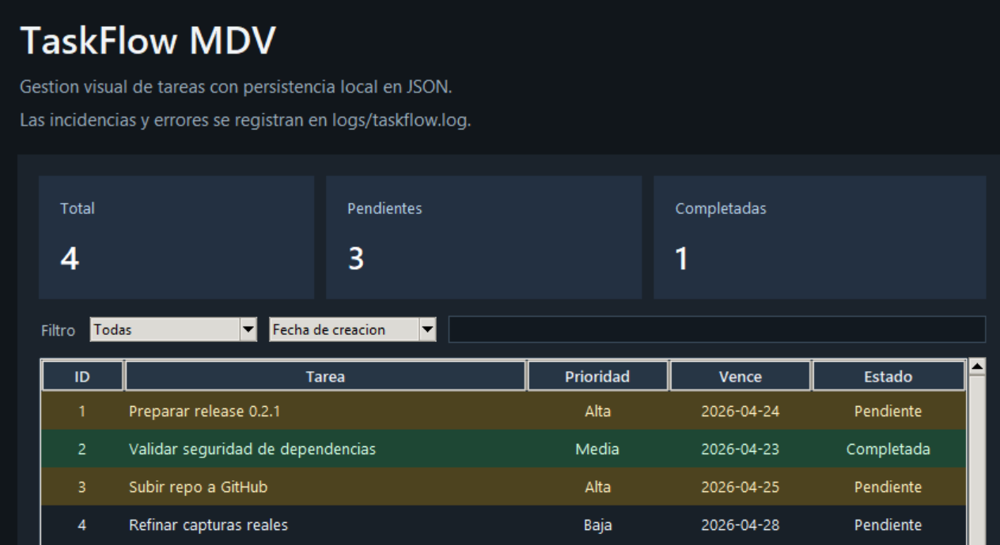
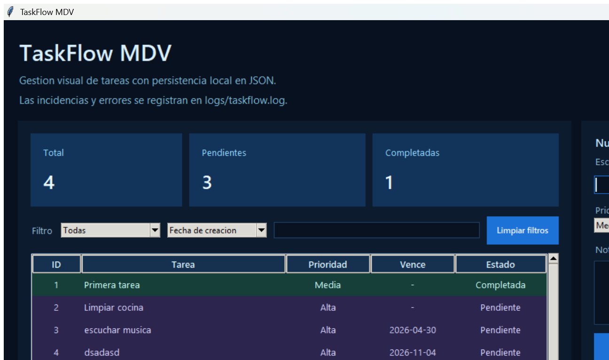

# TaskFlow MDV

Aplicacion de escritorio en Python para gestion de tareas, construida con arquitectura `MDV` (`Modelo`, `Datos`, `Vista`) y una interfaz visual hecha con `tkinter`.

## Caracteristicas

- creacion, edicion, completado, reapertura y eliminacion de tareas
- prioridad, responsable, fecha de vencimiento y notas por tarea
- filtros, busqueda y ordenamiento
- alertas visuales para tareas vencidas o proximas a vencer
- selector de tema con modos `clara`, `oscura` y `blue-coding`
- exportacion e importacion de tareas en JSON
- duplicado rapido de tareas y reinicio de filtros
- sincronizacion opcional con carpeta de Google Drive
- recarga manual y actualizacion automatica ante cambios externos del archivo
- persistencia local en JSON
- logs en archivo
- ejecutable para Windows con `PyInstaller`

## Vista general

La interfaz actual incluye:

- tabla de tareas con filtros, busqueda y ordenamiento
- panel lateral de detalle y edicion
- notas por tarea y responsable reutilizable
- alertas visuales por prioridad y vencimiento
- selector de tema con variantes `clara`, `oscura` y `blue-coding`
- acciones de respaldo y restauracion de tareas
- boton para limpiar filtros y duplicar tareas existentes
- conexion opcional a una carpeta sincronizada de Google Drive
- recarga del archivo cuando hay cambios desde fuera de la app

## Capturas reales

### Tema clara



### Tema oscura



### Tema blue-coding



## Tecnologias

- Python 3.12
- tkinter
- pytest
- PyInstaller

## Arquitectura

El proyecto sigue una separacion `MDV`:

- `model`: entidades del dominio
- `data`: persistencia y configuracion
- `view`: interfaz grafica y flujo de interaccion

Estructura principal:

```text
proyecto-mdv-python/
|-- src/
|   |-- main.py
|   |-- model/
|   |-- data/
|   `-- view/
|-- docs/
|-- tests/
|-- storage/
|-- logs/
|-- VERSIONES.md
`-- requirements.txt
```

## Ejecucion

Desde la raiz del proyecto:

```bash
python -m src.main
```

## Ejecutable

Para generar el ejecutable de Windows:

```bash
python -m PyInstaller --name TaskFlowMDV --windowed --onefile src/main.py
```

El binario se genera en `dist/`.

## Configuracion

La aplicacion guarda datos locales en:

- `storage/tasks.json`: tareas
- `storage/settings.json`: preferencias visuales
- `logs/taskflow.log`: eventos y errores

Tambien puedes exportar e importar respaldos JSON desde la interfaz.

Si usas Google Drive para escritorio, puedes elegir una carpeta sincronizada y la app guardara ahi el archivo principal de tareas.

## Versiones

El historial funcional y la numeracion de versiones se documentan en [VERSIONES.md](C:\Users\x13\proyecto-mdv-python\VERSIONES.md).

Version actual:

- `0.5.0`

## Seguridad

Para auditar vulnerabilidades conocidas en las dependencias declaradas:

```bash
python -m pip_audit -r requirements.txt
```

Estado actual:

- sin vulnerabilidades conocidas detectadas en la ultima revision con `pip-audit`

## Pruebas

Para ejecutar la suite:

```bash
python -m pytest -q
```

## Documentacion adicional

- `docs/`: arquitectura y flujo de la aplicacion
- `src/*/README.md`: descripcion breve por modulo

## Roadmap corto

- seguir refinando la experiencia visual
- ampliar configuraciones de usuario
- agregar categorias o etiquetas
- historial de cambios por tarea
